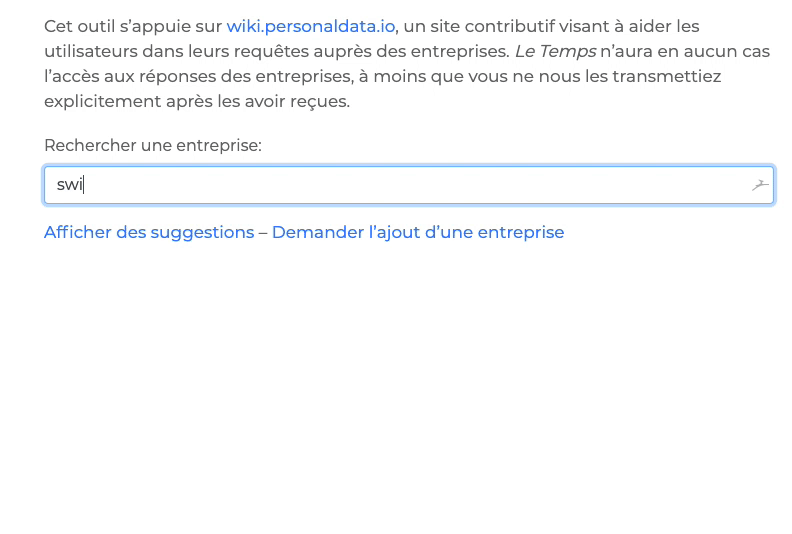

# SAR Request Helper

Simple tool to help ask companies for personal data, using data and template from https://wiki.personaldata.io ([@pdehaye](https://github.com/pdehaye)).

Update the quick list (stored in [companies.json](data/companies.json)) using [\_util/sparql_query_pdio.ipynb](_util/sparql_query_pdio.ipynb).

